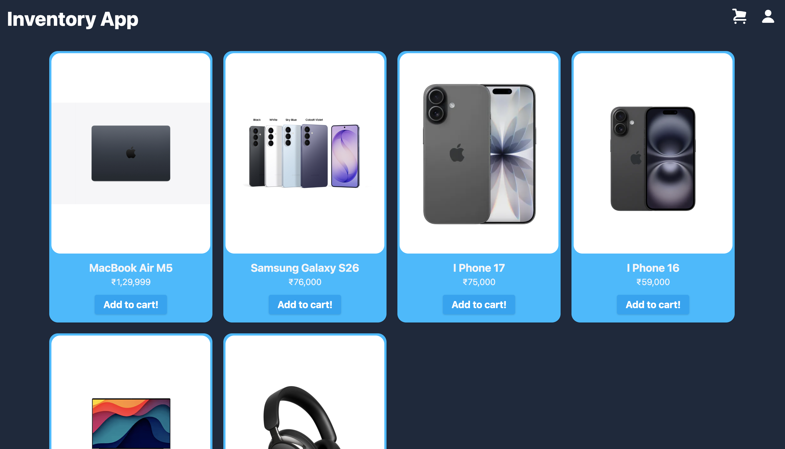
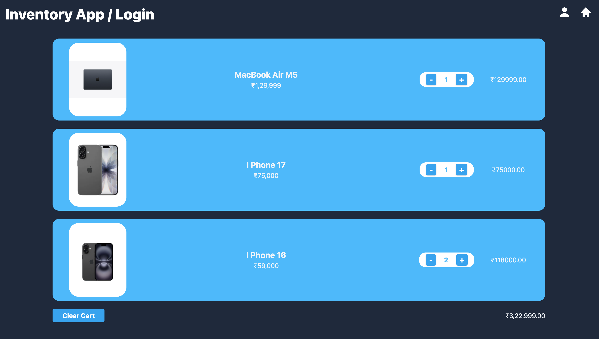
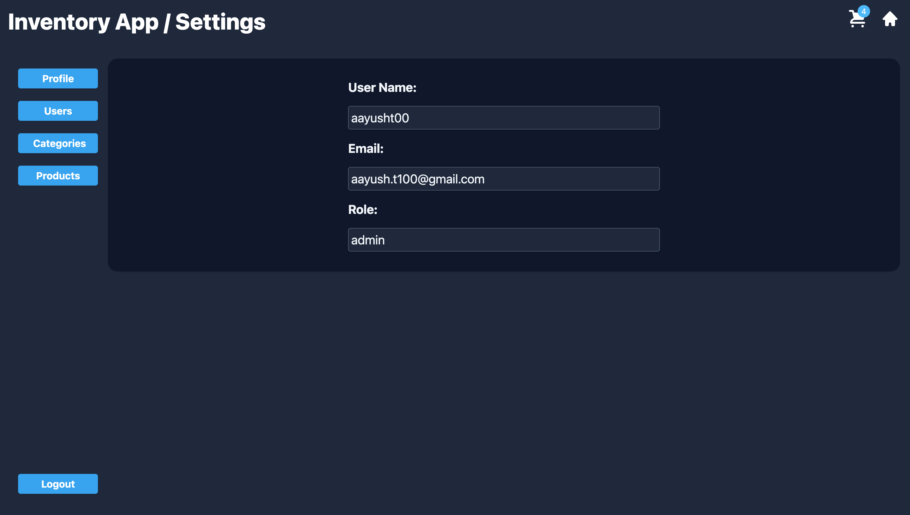
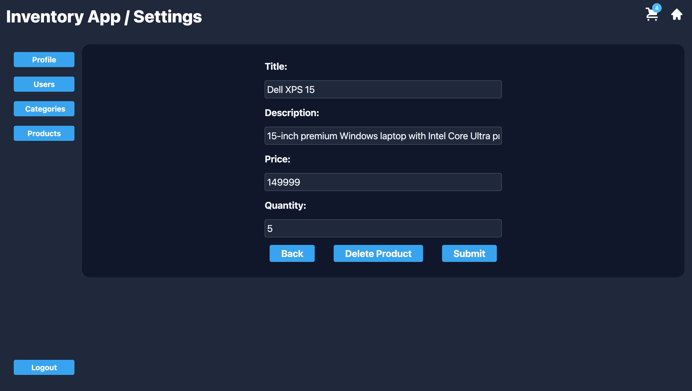

# Inventory Application

A full-stack inventory and shopping-cart application built with a React/TypeScript frontend and an Express/PostgreSQL backend. The app supports product browsing, product images served from the backend, cart management, user signup/login, JWT-based authentication, role-based admin controls, PostgreSQL-backed inventory data, and per-user cart persistence in `localStorage`.

> Note: this project is still in active development. Product browsing, cart behavior, profile/settings, admin user creation, category listing, and product edit/delete flows are implemented. Product/category creation UI and checkout/order persistence are not implemented yet.

## Highlights

- JWT authentication with bcrypt password hashing
- Role-based authorization for admin-only operations
- Product browsing with backend-served product images
- Admin product edit/delete flow
- PostgreSQL relational database with users, categories, and products
- React Context state management for auth, products, and cart data
- TypeScript frontend with typed context and service-layer models
- Per-user cart persistence with `localStorage`
- Reusable UI components for forms, pages, product cards, cart cards, and controls
- Responsive product grid built with Tailwind CSS

## Screenshots

| Product Grid | Cart |
| --- | --- |
|  |  |

| Settings | Admin Product Editor |
| --- | --- |
|  |  |

## Tech Stack

### Frontend

- React
- TypeScript
- Vite
- React Router
- React Context
- Tailwind CSS
- Heroicons
- Oxlint

### Backend

- Node.js
- Express
- PostgreSQL
- `pg`
- JSON Web Tokens
- bcrypt
- CORS
- Nodemon

## Architecture

```text
React UI
   |
React Context Providers
   |
Client Service Layer
   |
Express API Routes
   |
Controllers
   |
SQL Query Modules
   |
PostgreSQL
```

## Project Structure

```text
.
├── client
│   ├── src
│   │   ├── components          # Shared UI, product, cart, settings, and CRUD components
│   │   ├── context             # Auth, product, and cart providers
│   │   ├── helperFunctions     # API service helpers
│   │   ├── pages               # Product grid, cart, login, signup, settings
│   │   ├── App.tsx             # Client-side routes
│   │   └── main.tsx            # React provider tree and app entry
│   └── package.json
└── server
    ├── controller              # Route handlers
    ├── middleware              # JWT auth and admin validation
    ├── public/images           # Static product images
    ├── queries                 # SQL query strings
    ├── routes                  # Express routers
    ├── schema                  # Database schema and seed SQL
    ├── connection.js           # PostgreSQL pool
    ├── server.js               # Express app entry
    └── package.json
```

## Feature Overview

### Authentication

- User signup and login
- Password hashing with bcrypt
- JWT access tokens stored on the client as `accessToken`
- Auth restoration on page refresh through `/api/users/getuser`
- Logout flow from the settings page

### Authorization

- Protected API routes using bearer tokens
- Admin-only product and category API operations
- Admin-only user creation flow
- Settings page conditionally shows admin panels based on the authenticated user role

### Inventory

- Product grid fetches inventory from the backend API
- Product cards display image, title, price, and cart controls
- Product images are served as static Express assets from `server/public/images`
- Admin product list allows selecting products for editing
- Admin product editor supports updating core product fields
- Admin product editor supports deleting products

### Shopping Cart

- Add and remove product quantity from product cards
- Cart badge shows the current item count
- Cart page displays line items, quantity controls, clear-cart action, and INR total
- Cart data is persisted per logged-in user with `localStorage` keys in the format `cart:<username>`

### Admin Panel

- Profile panel for current user details
- User creation panel for admin-created users/admins
- Category listing panel
- Product list and product edit/delete panel

### Database

- PostgreSQL database with users, categories, and products
- UUID primary keys
- Foreign-key relationships for product categories, product creators, and category creators

## State Management

The React app is organized around typed Context providers:

- `AuthContext` manages the current user and auth restoration.
- `ProductContext` loads and exposes product data, loading state, and fetch errors.
- `CartContext` manages cart quantities, totals, clear-cart behavior, and per-user persistence.

## Reusable Components

The frontend uses reusable components instead of duplicating UI logic:

- `Button`
- `Input`
- `InputError`
- `Header`
- `Page`
- `ResetButton`
- `ProductCard`
- `CartCard`
- `CartTracker`
- `SignupForm`
- `ProductCrud`
- `ProductForm`
- `CategoryCrud`
- `Profile`
- `ErrorPage`

## Frontend Routes

| Route | Description |
| --- | --- |
| `/` | Product grid |
| `/products` | Product grid |
| `/cart` | Shopping cart |
| `/login` | Login page |
| `/signup` | Signup page |
| `/setting` | Settings page with profile, logout, and admin panels |
| `*` | 404 page |

## Backend API Routes

### Products

| Method | Endpoint | Access | Description |
| --- | --- | --- | --- |
| `GET` | `/api/products` | Public | Get all products |
| `GET` | `/api/products/new` | Admin | Get an empty product object |
| `POST` | `/api/products/new` | Admin | Create a product |
| `GET` | `/api/products/:id` | Public | Get one product |
| `PUT` | `/api/products/:id` | Admin | Update a product |
| `DELETE` | `/api/products/:id` | Admin | Delete a product |

### Categories

| Method | Endpoint | Access | Description |
| --- | --- | --- | --- |
| `GET` | `/api/category/getAll` | Public | Get all categories |
| `GET` | `/api/category/create` | Admin | Get an empty category object |
| `POST` | `/api/category/create` | Admin | Create a category |

### Users

| Method | Endpoint | Access | Description |
| --- | --- | --- | --- |
| `POST` | `/api/users/signup` | Public | Create a standard user |
| `POST` | `/api/users/login` | Public | Login and receive an access token |
| `GET` | `/api/users/getuser` | Authenticated | Get the current user |
| `POST` | `/api/users/signup-admin` | Authenticated/Admin | Create a user/admin account |

## Database

The database contains three main tables:

- `users`
- `category`
- `products`

Schema and seed files are in:

```text
server/schema/
├── createtionQuery.sql
├── dummyData.sql
└── tableSchema.sql
```

The tables use UUID primary keys and foreign-key relationships for product categories, product creators, and category creators.

## Environment Variables

Create a `.env` file in the `server` directory:

```env
PORT=3000
DB_USER=your_postgres_user
DB_PASSWORD=your_postgres_password
DB_HOST=localhost
DB_NAME=inventory
JWT_SECRET=your_jwt_secret
CLIENT_ORIGIN=http://localhost:5173
```

## Getting Started

### 1. Install Dependencies

Install client dependencies:

```bash
cd client
npm install
```

Install server dependencies:

```bash
cd ../server
npm install
```

### 2. Set Up PostgreSQL

Create the database and tables using the SQL files in `server/schema`.

At minimum, create the `inventory` database and run:

```text
server/schema/createtionQuery.sql
```

Optional seed data is available in:

```text
server/schema/dummyData.sql
```

### 3. Start the Backend

From the `server` directory:

```bash
npm run server
```

The API runs on:

```text
http://localhost:3000
```

The backend also serves static product images from:

```text
http://localhost:3000/images/<file-name>
```

### 4. Start the Frontend

From the `client` directory:

```bash
npm run dev
```

Vite will print the frontend URL in the terminal. The backend CORS configuration reads from `CLIENT_ORIGIN` and falls back to:

```text
http://localhost:5173
```

If Vite starts on a different port, set `CLIENT_ORIGIN` in `server/.env` or start Vite on the matching port.

## Available Scripts

### Client

```bash
npm run dev
npm run build
npm run lint
npm run preview
```

### Server

```bash
npm run server
npm test
```

`npm test` is currently a placeholder script in the server package.

## Implementation Notes

- The React app is wrapped in `AuthProvider`, `ProductProvider`, and `CartProvider`.
- Products are fetched once through `ProductProvider` using `getAllProduct`.
- Product image URLs are rendered as `http://localhost:3000${image_url}`.
- Cart state is stored per logged-in username in `localStorage`.
- Logging out removes the JWT token and resets the auth context.
- The settings page contains profile display, logout, and admin-only panels for users, categories, and products.
- Product admins can select a product, edit core fields, submit updates, or delete the product.
- Category admin UI currently lists categories fetched from the backend.
- Theme variables for light and dark modes are defined, but there is not yet a visible theme toggle.
- Admin-only API routes require an `Authorization: Bearer <token>` header.

## Live Demo

No live deployment is configured yet.

When deployed, add links here:

- Frontend:
- Backend/API:

## Roadmap

- Product creation UI
- Category creation, edit, and delete UI
- Checkout flow
- Order history
- Product image upload
- Product search
- Product filtering
- Pagination
- Toast notifications
- Frontend route guards for authenticated/admin-only screens
- Environment-based API base URLs
- Automated tests for auth, products, cart behavior, and protected routes
- Mobile improvements for the cart page

## Known Limitations

- The cart page currently uses a wide fixed grid layout in `CartCard`, so mobile responsiveness needs more work.
- Theme variables for light and dark modes are defined, but there is not yet a visible theme toggle.
- Checkout and order persistence are not implemented.
- Automated tests are not implemented yet.

## License

MIT
